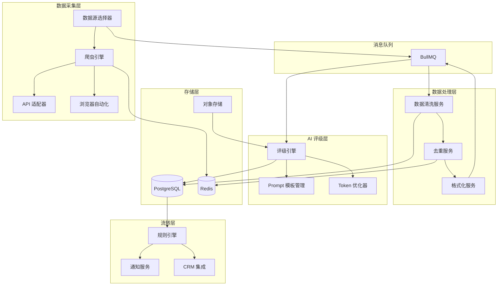
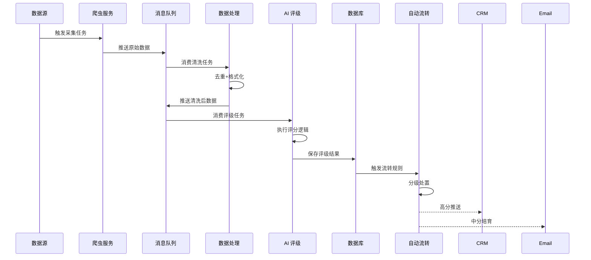
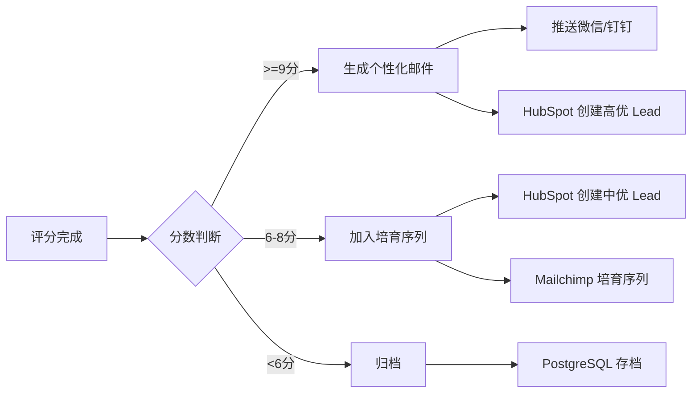

# 爬虫 + AI 评级全流程方案设计

基于 JS/TS 技术栈的高扩展性企业线索采集与智能评级系统架构方案。

## 系统概述

本方案设计一个模块化、高扩展的自动化系统，实现从数据采集、清洗预处理、AI 智能评级到自动化流转的全流程闭环。系统采用微服务架构思想，各模块独立部署，通过消息队列解耦，支持水平扩展。

## 核心技术栈

### 运行时与框架
- **运行时**: Node.js 18+ / Bun (高性能替代)
- **语言**: TypeScript (类型安全 + 开发体验)
- **Web 框架**: NestJS (企业级框架，支持依赖注入、模块化)

### 数据采集层
- **爬虫框架**: Playwright (跨浏览器、反爬能力强)
- **API 客户端**: Axios + Retry 机制
- **HTML 解析**: Cheerio (轻量) / Playwright 原生选择器
- **转换工具**: Firecrawl SDK / Jina Reader API

### 数据存储
- **主数据库**: PostgreSQL (结构化数据 + JSONB 支持)
- **缓存层**: Redis (任务队列、去重、限流)
- **对象存储**: MinIO / S3 (原始 HTML、截图存储)

### 消息队列与调度
- **消息队列**: BullMQ (基于 Redis 的任务队列)
- **任务调度**: Node-cron / BullMQ Repeatable Jobs
- **工作流编排**: Temporal.io (复杂工作流场景)

### AI 集成
- **LLM 接口**: OpenAI SDK / Anthropic SDK
- **Prompt 管理**: LangChain.js
- **Token 计数**: tiktoken (精确控制成本)

### 自动化流转
- **Webhook**: Express / NestJS REST API
- **集成平台**: Make.com / n8n (自建开源替代)
- **CRM SDK**: HubSpot API / Salesforce REST API

---

## 系统架构设计

### 整体架构图



### 数据流设计



---

## 第一阶段：数据采集层设计

### 模块结构

```
src/scraper/
├── adapters/              # 数据源适配器
│   ├── linkedin.adapter.ts
│   ├── apollo.adapter.ts
│   ├── gmaps.adapter.ts
│   ├── qichacha.adapter.ts
│   └── base.adapter.ts
├── engines/               # 爬虫引擎
│   ├── playwright.engine.ts
│   ├── api.engine.ts
│   └── firecrawl.engine.ts
├── strategies/            # 反爬策略
│   ├── proxy-pool.ts
│   ├── rate-limiter.ts
│   └── user-agent.ts
├── queue/                 # 任务队列
│   ├── scraper.producer.ts
│   └── scraper.consumer.ts
└── scraper.service.ts
```

### 核心设计要点

**1. 适配器模式 - 统一数据源接口**

每个数据源实现相同接口，便于扩展新数据源：

```typescript
interface IScraperAdapter {
  source: string;
  scrape(params: ScrapeParams): Promise<RawData[]>;
  validate(data: RawData): boolean;
  transform(data: RawData): StandardData;
}
```

**2. 策略模式 - 灵活切换爬取策略**

根据数据源特性选择最优策略：
- **轻量 API** → 直接 HTTP 请求
- **需登录/JS 渲染** → Playwright 浏览器自动化
- **第三方服务** → Firecrawl/Jina Reader API

**3. 任务队列 - 解耦与可靠性**

- 使用 BullMQ 实现任务持久化
- 支持失败重试（指数退避）
- 优先级队列（高价值数据源优先）

**4. 反爬措施**

| 措施 | 实现方案 |
|------|---------|
| 代理池 | 集成 Bright Data / Oxylabs / 自建代理池 |
| 限流 | Redis + Token Bucket 算法 |
| 指纹伪装 | Playwright Stealth Plugin |
| 请求间隔 | 随机延迟 (1-5s) |

---

## 第二阶段：数据处理层设计

### 模块结构

```
src/processor/
├── cleaners/              # 清洗器
│   ├── html.cleaner.ts
│   ├── text.cleaner.ts
│   └── contact.cleaner.ts
├── deduplicators/         # 去重器
│   ├── domain.dedup.ts
│   ├── usci.dedup.ts     # 统一社会信用代码
│   └── redis.dedup.ts
├── transformers/          # 转换器
│   ├── json.transformer.ts
│   └── markdown.transformer.ts
├── queue/
│   ├── processor.consumer.ts
│   └── processor.producer.ts
└── processor.service.ts
```

### 处理管道设计

采用**责任链模式**构建可扩展的处理管道：

```typescript
type ProcessorPipeline = [
  HtmlCleaner,       // 1. 清理 HTML 标签
  TextNormalizer,    // 2. 文本规范化（去空格、统一编码）
  ContactExtractor,  // 3. 提取联系方式
  DomainDeduplicator,// 4. 域名去重
  JsonTransformer,   // 5. 转换为标准 JSON
  TokenEstimator     // 6. 估算 Token 数量
];
```

### 去重策略

**多级去重机制**：

1. **布隆过滤器**（Redis）- 快速预判
2. **精确去重**（PostgreSQL Unique Index）- 最终保证
3. **相似度去重**（可选）- 使用 SimHash 检测近似重复

**去重键设计**：

```typescript
interface DeduplicationKey {
  primary: string;   // 域名 / USCI
  secondary?: string; // 公司名 + 地区哈希
  fingerprint?: string; // 内容指纹
}
```

### 数据瘦身策略

**仅提取核心字段**，减少 Token 消耗：

```typescript
interface SlimCompanyData {
  // 必需字段
  name: string;
  domain: string;
  industry: string;
  
  // 高价值信号
  jobPostings?: string[];      // 招聘职位
  recentNews?: string[];       // 最新动态（仅标题）
  productDescription?: string; // 产品描述（前 500 字符）
  
  // 计算字段
  estimatedSize?: string;      // 'small' | 'medium' | 'large'
  fundingStage?: string;
}
```

---

## 第三阶段：AI 评级层设计

### 模块结构

```
src/rating/
├── engines/
│   ├── openai.engine.ts
│   ├── anthropic.engine.ts
│   └── base.engine.ts
├── prompts/
│   ├── templates/
│   │   ├── b2b-saas.prompt.ts
│   │   ├── ecommerce.prompt.ts
│   │   └── default.prompt.ts
│   └── prompt.builder.ts
├── scorers/
│   ├── rule-based.scorer.ts
│   ├── llm.scorer.ts
│   └── hybrid.scorer.ts
├── optimizers/
│   ├── token.optimizer.ts
│   └── batch.processor.ts
├── queue/
│   └── rating.consumer.ts
└── rating.service.ts
```

### 评分模型设计

**混合评分策略**：规则引擎 + LLM 评分

```typescript
interface RatingResult {
  totalScore: number;        // 0-10 总分
  breakdown: {
    firmographics: number;   // 基础匹配度 (0-3)
    intentSignals: number;   // 意向信号 (0-4)
    painPoints: number;      // 痛点关联 (0-3)
  };
  confidence: number;        // 置信度 (0-1)
  reasoning: string;         // 评分理由
  icebreaker: string;        // 建议切入点
}
```

### 评级维度配置化

支持通过配置文件定义评分规则：

```typescript
interface RatingConfig {
  model: 'gpt-4o' | 'claude-3.5-sonnet';
  dimensions: {
    name: string;
    weight: number;
    rules: ScoringRule[];
  }[];
  thresholds: {
    high: number;    // >= 9 分
    medium: number;  // >= 6 分
    low: number;     // < 6 分
  };
}
```

### Prompt 工程最佳实践

**模板结构**：

```typescript
const B2B_SAAS_PROMPT = `
# 角色
你是一位资深的 B2B SaaS 销售分析师，擅长识别高价值潜在客户。

# 任务
评估以下公司与"{产品名称}"的匹配度，输出 0-10 分评分。

# 公司信息
\`\`\`json
{companyData}
\`\`\`

# 评分准则
## 基础匹配度 (0-3 分)
- 目标行业：{targetIndustries}
- 目标规模：{targetSize}
- 目标地区：{targetRegions}

## 意向信号 (0-4 分)
- 正在招聘相关岗位：+2 分
- 近期获得融资：+1 分
- 社交媒体提及相关痛点：+1 分

## 痛点关联度 (0-3 分)
- 官网显示技术栈落后：+1.5 分
- 用户增长缓慢/停滞：+1.5 分

# 排除条件
- 公司规模 < {minSize} 人：直接 0 分
- 已是竞品客户：直接 0 分

# 输出格式（严格 JSON）
\`\`\`json
{
  "score": 8.5,
  "breakdown": {"firmographics": 3, "intentSignals": 3, "painPoints": 2.5},
  "confidence": 0.85,
  "reasoning": "该公司属于目标行业，正在招聘客服主管（强意向信号），且官网技术栈显示仍使用传统工单系统。",
  "icebreaker": "注意到贵司正在扩招客服团队，我们的 AI 客服系统可帮助新客服 3 天上岗，减少 60% 培训成本。"
}
\`\`\`
`;
```

### Token 优化策略

| 策略 | 实现方式 | 节省比例 |
|------|---------|---------|
| 数据压缩 | 仅发送核心字段 | ~40% |
| 批量处理 | 单次请求评估多家公司 | ~30% |
| 缓存结果 | Redis 缓存相似公司评分 | ~20% |
| 模型选择 | 简单场景用 GPT-4o-mini | ~50% 成本 |

**批量处理示例**：

```typescript
// 单次 API 调用评估 5 家公司
const batchPrompt = `
评估以下 5 家公司，为每家输出评分：
1. {company1}
2. {company2}
...
`;
```

---

## 第四阶段：自动化流转层设计

### 模块结构

```
src/automation/
├── rules/
│   ├── rule.engine.ts
│   ├── scoring.rules.ts
│   └── routing.rules.ts
├── integrations/
│   ├── hubspot.integration.ts
│   ├── salesforce.integration.ts
│   ├── make.integration.ts
│   └── webhook.integration.ts
├── notifications/
│   ├── email.notifier.ts
│   ├── wechat.notifier.ts
│   └── dingtalk.notifier.ts
├── generators/
│   └── icebreaker.generator.ts
└── automation.service.ts
```

### 分级处置规则引擎

**声明式规则配置**：

```typescript
const routingRules: RoutingRule[] = [
  {
    condition: (lead) => lead.score >= 9,
    actions: [
      { type: 'notify', channels: ['wechat', 'dingtalk'] },
      { type: 'generate_email', template: 'personalized_outreach' },
      { type: 'crm_push', priority: 'high', owner: 'auto_assign' }
    ]
  },
  {
    condition: (lead) => lead.score >= 6 && lead.score < 9,
    actions: [
      { type: 'email_sequence', campaign: 'nurture_6month' },
      { type: 'crm_push', priority: 'medium', stage: 'lead' }
    ]
  },
  {
    condition: (lead) => lead.score < 6,
    actions: [
      { type: 'archive', reason: 'low_score' }
    ]
  }
];
```

### CRM 集成设计

**统一接口层**：

```typescript
interface ICRMIntegration {
  createLead(data: LeadData): Promise<string>;
  updateLead(id: string, data: Partial<LeadData>): Promise<void>;
  assignOwner(leadId: string, ownerId: string): Promise<void>;
}

// 实现类
class HubSpotIntegration implements ICRMIntegration {
  // 具体实现...
}
```

### 个性化邮件生成

**利用 AI 生成专属开场白**：

```typescript
const generateIcebreaker = async (lead: RatedLead) => {
  const prompt = `
基于以下线索信息，生成一句话开场白（50 字以内）：
- 公司：${lead.name}
- 评分理由：${lead.reasoning}
- 产品：${config.productName}

要求：
1. 展示对对方业务的理解
2. 暗示能解决的痛点
3. 不要提及"我们注意到"等套话
  `;
  
  return await llm.generate(prompt);
};
```

### 工作流编排 (n8n / Make.com)

**示例工作流**：



---

## 扩展性设计

### 1. 模块化与插件化

**插件接口示例**：

```typescript
interface IScraperPlugin {
  name: string;
  version: string;
  install(app: Application): void;
  scrape(params: unknown): Promise<unknown>;
}

// 使用
app.use(new LinkedInPlugin());
app.use(new QichachaPlugin());
```

### 2. 配置驱动

**核心配置文件 `config.yaml`**：

```yaml
scraper:
  sources:
    - name: linkedin
      enabled: true
      rate_limit: 100/hour
      adapter: linkedin.adapter
    - name: qichacha
      enabled: true
      adapter: qichacha.adapter

processor:
  pipeline:
    - html.cleaner
    - contact.extractor
    - domain.dedup
    - json.transformer

rating:
  model: gpt-4o
  config_file: ./prompts/b2b-saas.yaml
  batch_size: 5

automation:
  rules_file: ./rules/routing.rules.ts
  integrations:
    - hubspot
    - wechat
```

### 3. 水平扩展能力

**通过增加 Worker 实现扩展**：

```bash
# 启动多个爬虫 Worker
npm run worker:scraper -- --concurrency 10

# 启动多个评级 Worker
npm run worker:rating -- --concurrency 5
```

### 4. 监控与可观测性

**关键指标**：

```typescript
interface Metrics {
  scraper: {
    dailyScraped: number;
    successRate: number;
    avgResponseTime: number;
  };
  rating: {
    dailyRated: number;
    avgTokens: number;
    costPerLead: number;
  };
  automation: {
    highScoreLeads: number;
    emailsSent: number;
    crmPushes: number;
  };
}
```

**集成方案**：
- **日志**: Winston + Loki
- **指标**: Prometheus + Grafana
- **追踪**: OpenTelemetry

---

## 部署架构

### Docker Compose 示例

```yaml
version: '3.8'
services:
  postgres:
    image: postgres:16-alpine
    environment:
      POSTGRES_DB: lead_rating
      
  redis:
    image: redis:7-alpine
    
  scraper-worker:
    build: .
    command: npm run worker:scraper
    scale: 3
    depends_on:
      - postgres
      - redis
      
  rating-worker:
    build: .
    command: npm run worker:rating
    scale: 2
    environment:
      OPENAI_API_KEY: ${OPENAI_API_KEY}
      
  api:
    build: .
    command: npm run start:api
    ports:
      - "3000:3000"
    depends_on:
      - postgres
      - redis
```

### 成本估算

**假设场景**：每月采集 10,000 家公司

| 项目 | 单价 | 用量 | 月成本 |
|------|------|------|--------|
| OpenAI API (GPT-4o) | $2.5/1M tokens | ~50M tokens | $125 |
| 代理池 | $500/月 | - | $500 |
| 服务器 (4C8G × 2) | $50/月/台 | 2 台 | $100 |
| PostgreSQL (RDS) | $80/月 | - | $80 |
| **总计** | - | - | **$805** |

---

## 开发路线图

### Phase 1: MVP（2-3 周）
- [x] 搭建 NestJS 基础架构
- [ ] 实现 1-2 个数据源适配器（如 Google Maps）
- [ ] 完成基础数据处理管道
- [ ] 集成 OpenAI 实现简单评分
- [ ] 实现微信通知（高分线索）

### Phase 2: 扩展（3-4 周）
- [ ] 增加 5+ 数据源适配器
- [ ] 优化 Prompt 模板（A/B 测试）
- [ ] 集成 HubSpot CRM
- [ ] 实现批量处理与 Token 优化
- [ ] 添加监控仪表盘

### Phase 3: 企业级（4-6 周）
- [ ] 构建 Admin 管理界面
- [ ] 实现规则引擎可视化配置
- [ ] 增加数据源市场（插件商店）
- [ ] 完善错误处理与重试机制
- [ ] 安全加固（数据加密、权限控制）

---

## 风险与缓解

| 风险 | 影响 | 缓解措施 |
|------|------|---------|
| 数据源反爬升级 | 高 | 建立多数据源备份；使用第三方 API |
| AI API 成本超预算 | 中 | Token 优化；使用更便宜模型；设定每日配额 |
| 评分准确率低 | 高 | 持续优化 Prompt；建立人工反馈闭环 |
| 合规风险（数据隐私） | 高 | 遵守 GDPR/PIPL；仅采集公开信息；提供退订机制 |

---

## 下一步行动

1. **确认业务场景**：你的具体产品是什么？目标客户画像？
2. **选择首批数据源**：优先采集哪 2-3 个数据源？
3. **定义评分规则**：根据你的产品特性定制评分维度
4. **技术选型确认**：是否采用上述技术栈？是否有额外要求？

请告诉我，接下来你希望我：
- A. 提供具体模块的代码实现示例
- B. 生成详细的 API 设计文档
- C. 创建项目脚手架代码
- D. 针对某个特定场景深化方案
